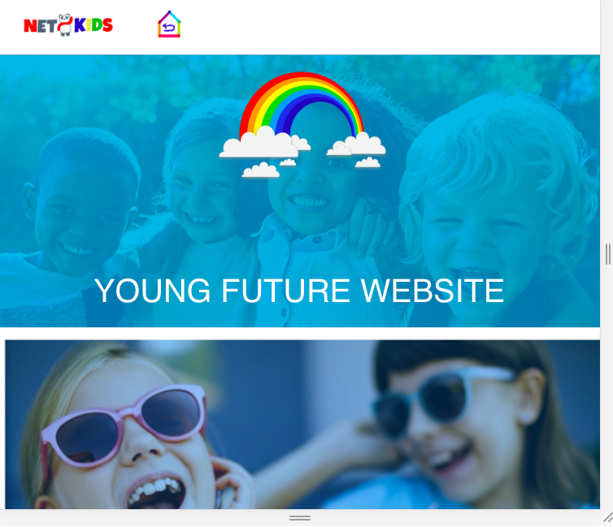
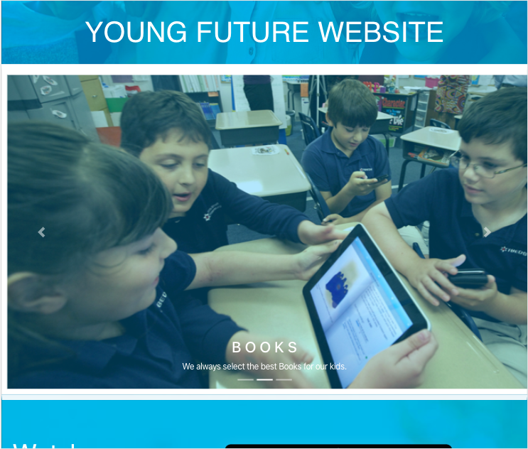
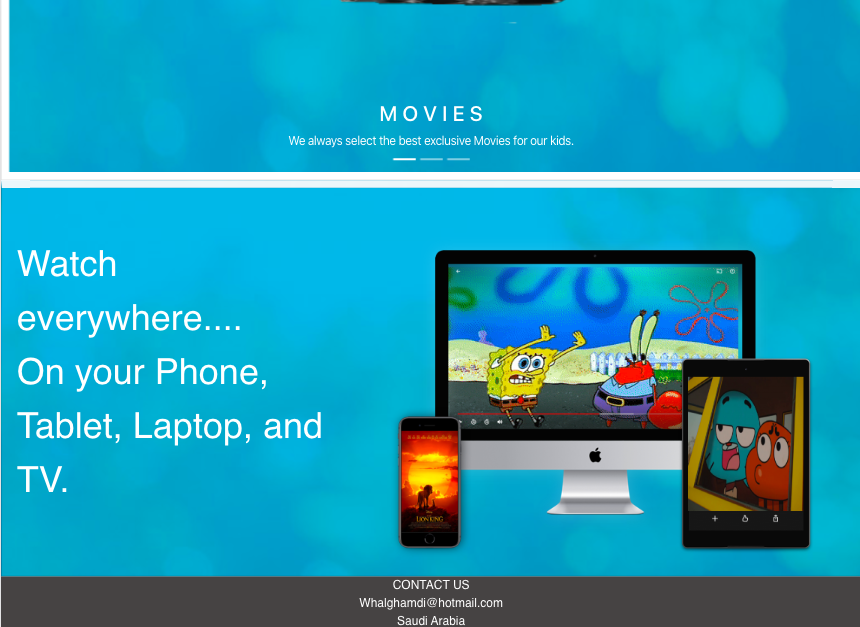
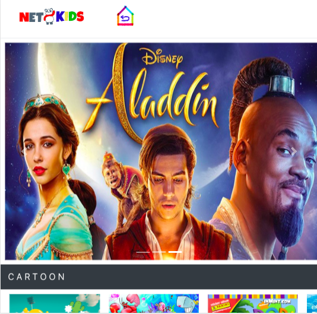
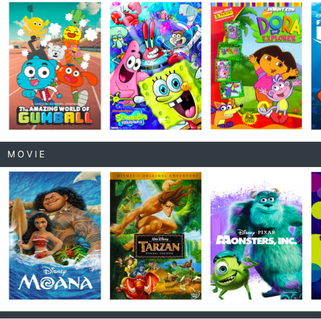
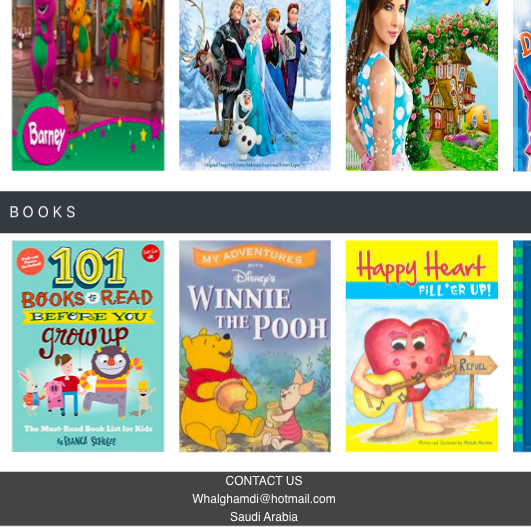
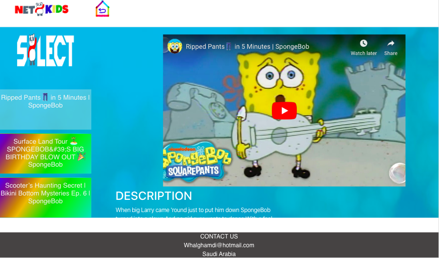

# Title Project 
Net Kids 

## Description
NetKids website is platform for all kids needs in entertement , best movie , music , cartoon , and book.
what i done , use youtube API to get cartoon by channelID 

### Technical Used
Fetch youtube API 
router
react 
react bootstrap 

### Wireframes

## Planning and Development Process 

for the future, I'm planning to enhance the UX and make complete website.
### Unsolved problems
set state for switch between channel
